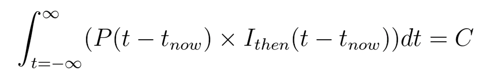

# Conservation of Causality: Generalizing Conservation of Information Makes the Physical Universe Possible, Renders Event Horizons Boring, and Unifies Physics

by G2 Author

## Abstract
This paper proposes that conservation of information be generalized into the dimension of time so that it includes not only the conservation of instantaneous information, but also conservation of the integral of all extant information, including predictability and postdictability,for any given moment in time. The author is calling this conserved integral *causality*. Satisfaction of this new dimension of conservation ensures that the physical universe is able to exist, and forces changes upon quantum mechanics, and perhaps general relativity, which the author suspects will allow the unification of physics.

## This Preprint's Limitations
The author of this paper is a retired electronics and software engineer, and their knowledge of general relativity and quantum mechanics is limited to fifty years of reading Scientific American and similar publications, which means that, in preprint form at least, this paper's standards of domain expertise and academic rigor will be unavoidably low. Please forward any instances of relevant priority to the author, who means well but just really doesn't know anything.

## Conservation of Causality
### The sum of the universe's causal information is constant
The current view of conservation of information says that information is never lost, and this has proven true in countless experiments.

The author proposes that information conservation stated in the conventional way is not fundamental, and is rather a special case of a more restrictive and more general law: the *conservation of causality*.

Establishing the meaning of causality requires starting with the most basic question about our physical universe, which is whether or not it is possible for it to have infinite longevity, yet contain finite information. A deterministic, non-repeating, spatially finite billiard-ball universe of infinite longevity would produce a predetermined history of infinite complexity, meaning that such a universe requires at least infinte precision for each property of each particle. The current model of quantum mechanics adds randomness, but it does so without reducing the information requirement below infinity. 

From this we see that if we can create a mathematical description of the universe which works with merely finite information and which contains no internal contradictions, then that description must be infinitely preferable to one which requires infinte information.

Conservation of causality enforces that constraint, which allows a spatially finite universe like ours to come into existence using only a finite amount of information.

Establishing that our universe must contain finite information despite its potentially infinite longevity immediately points to particles as the containers of very nearly all of the universe's information. Non-particle entities in the universe occur at very large scales, which makes their information-carrying capacity vanishingly small compared to that of particles.

Knowing that the universe's finite informaton is contained in particles tells us that the information contained in each particle is finite, which further tells us that the various parameters that compose the physical existence of the particle, such as position and momentum, must have limited precision. Of course it is assumed that the information is physically contained in the particle's mass-energy, since that is the simplest mechanism.

That limited precision is a (and perhaps the) primary source of fundamental randomness in our universe. Each time two particles interact, their interaction performs a calculation using the limited precision of the available information, and the calculation creates a result set of new particles whose total mass-energy and total information quantity are conserved, and that conserved information is encoded into the new particles. 

Although the new particles contain the same total amount of information as the old particles, they do *not* contain all of the information in the original particle set. Some of that information has been lost due to limited precision, and the new particles gain the complete certainty of their own state that comes from holding the defining data. This loss of precision represents a reduced ability to infer the state of the old particles from the information in the new particles. In other words, a small piece of the causal past has been lost forever, making the calculation only approximately reversible.

In our physical reality this loss is experimentally indectable over the smallish numbers of interactions that are captureed by experiment, giving the impression that information is conserved with infinite precision.

This loss accumulates exponentially with the number of interactions that take place, and after a sufficient number of interactions it reduces the causal significance of the more distant past to where it is lower in magnitude that the randomness injected into the process at each step by loss of precision, at which point the causal influence of any events farther in the past has reached exactly zero.

It seems possible that different particle interactions will lose differing amounts of causal information. For example, and interaction that only exchanges momentum would be expected to only lose momentum information, while an interaction that alters particle identity as well will be transforming more parameters, and therefore losing more information. This nuance is worth a lot more attention that I'm able to give it, and for now I'm going to make the simplifying assumption that these losses can be treated as statistically constant. 

If we look a toy system of isotopically stable gas held in thermal equilibrium, we can write an equation to illustrate the concept. Most practical versions of this equation will be much more complex, but the principle will remain the same.

* *Inow* is the aggregate of all information that is carried by the particles under consideration at time = now. This simplified notion of time disregards the speed of causality.
* *Pavg* is the average fraction of causal information retained in each interaction. This number is slightly less than one due to the loss of precision in the calculation that performs the transformation of particle properties, and can be thought of as *precision* or *predictability/postdictability*.
* *Kavg* is the average number of interactions that each particle experiences per second.
* *P(t - tnow)* is the cumulative fraction of causal information wihch is retained during the interactions within the time interval. It is approximately equal to *Pavg* raised to the power of *(Kavg* &#215; *(t - tnow))*, except that it goes to exactly zero for time distances beyond which the magnitude of the result dips below approximately *(1 - Pavg)*.
* *Ithen(t - tnow)* is all of the information about the moment at time *t* which can be calculated from *Inow* using infinite precision math.
* *C* is the conserved value of causality.

 In equation form, causality is the integral of all extant information about how the universe interacts with itself from time negative infinity to time plus infinity for any given *tnow*. 

 

The author does not know what the dimensionality of terms *Ithen* or *C* should be, but that deficit does not affect the implications of the conserved property.

## Implications
### Some interactions may perhaps be lossless
Because loss of causality happens due to loss of precision during computationally non-trivial interactions, it seems possible that there could exist mathematically trivial interactions which might escape this loss. Perhaps photon reflections which are close enough to normal might invoke a lossless transform of sign inversion, for example.

### Time is not reversible
The loss of causality during non-trivial interactions means that time is fundamentally irreversible in a universe defined by a finite amount of information.

### Causality in the presence of structure
It is relatively easy to visualize causality for liquids, gasses, and plasmas, but the self-stabilizing structure of solids make them more difficult to visualize. They pose no problem to the overall concept, but their mathematical representation is beyond the author.

### Conservation of causality versus conservation of information
For small interactional distances, *P(t - tnow)* is so close to unity that conservation of causality collapses to the current incorrect view of conservation of information, which makes the information-proliferating assumption that *P(t - tnow)* is unity for all time *t*.

### Event horizons are no longer so interesting
Knowing that specific causality is not conserved while the sum total of causality is conserved simplifies black holes enormously. Rather than information being mysteriously encoded onto an event horizon, an infalling body gets bathed in high-temperature and high-pressure reactions which quickly erases any causality contained in the structure of the infalling body. The simple mass-energy of the black hole is then a perfecly fitting container for all of the black hole's information.

## Next Steps
The author’s enthusiasm and mathematical skills break down completely at this point, and they have no intention of pursuing this beyond this basic sketch. They hope that others will find this idea useful.
